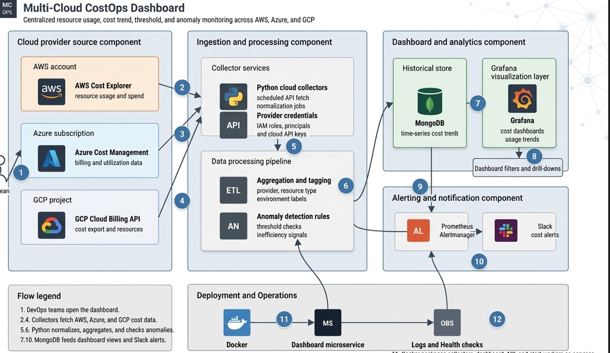

Complete Sprint-by-Sprint Project Execution Plan
🛠️ Sprint 1: Project Setup and Basic Cloud Integration
Goal: Establish cloud provider connectivity and fetch baseline sample payloads to lay the development groundwork 
Execution Tasks:Repository Build: Create a clean repository structure containing dedicated /backend and /frontend folders .Environment Isolation: Set up local .env configuration files to securely manage credentials for AWS, Azure, and GCP 
Connectivity Verification: Write script connectors leveraging boto3, azure-mgmt-costmanagement, and google-cloud-billing SDKs to verify infrastructure permissions 
Data Shape Analysis: Pull real metadata records from cloud endpoints and analyze their underlying JSON models 

